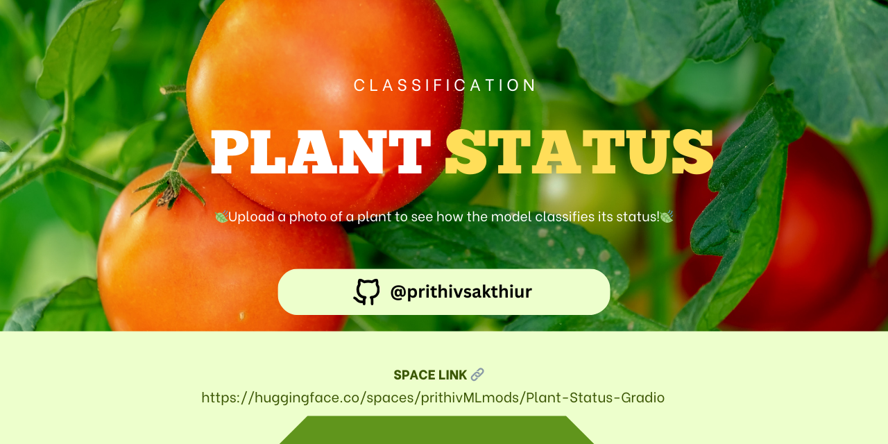
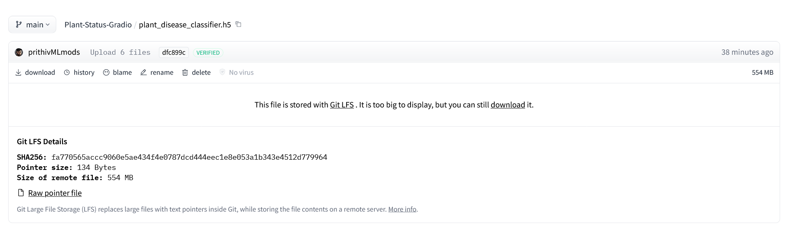
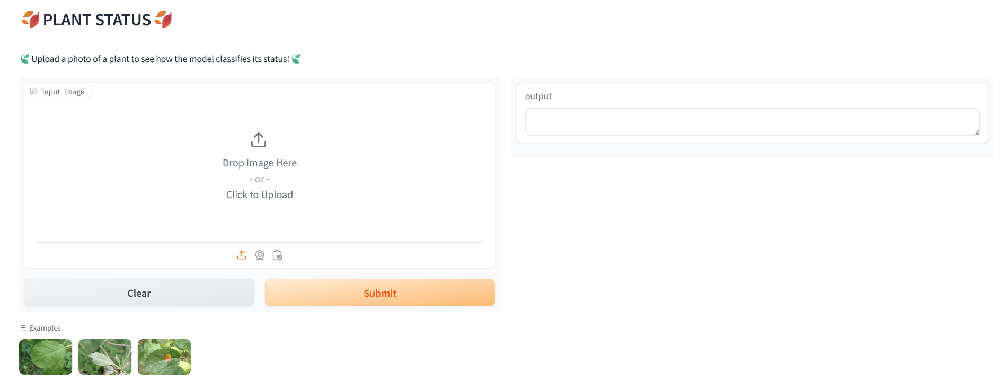
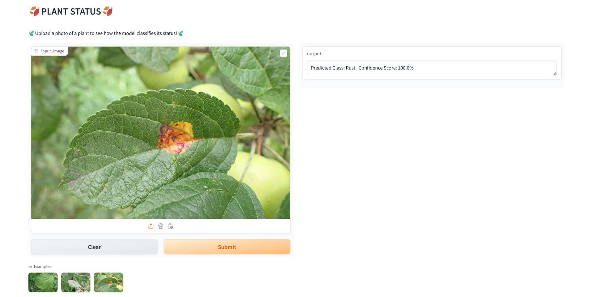

## Healthy Powdery Rust - Plant Status 🍃🍁

🪶Check out the configuration reference at https://huggingface.co/docs/hub/spaces-config-reference

🚀Huggingface space : https://huggingface.co/spaces/prithivMLmods/Plant-Status-Gradio

🚀To Clone Just Install Git Past the Command : 

# Make sure you have git-lfs installed (https://git-lfs.com)
git lfs install

git clone https://huggingface.co/spaces/prithivMLmods/Plant-Status-Gradio

# If you want to clone without large files - just their pointers

GIT_LFS_SKIP_SMUDGE=1 git clone https://huggingface.co/spaces/prithivMLmods/Plant-Status-Gradio

## 📄Run with Docker

docker run -it -p 7860:7860 --platform=linux/amd64 \
	registry.hf.space/prithivmlmods-plant-status-gradio:latest python app.py

## ⬇️Download the H5 [ plant_disease_classifier.h5 ] from Repo :

Link🔗 : https://huggingface.co/spaces/prithivMLmods/Plant-Status-Gradio/blob/main/plant_disease_classifier.h5

## 📟The Plant Status Page :

## 🍃The Classification Result : 

## How to run Docker Img : 

Link🔗: https://huggingface.co/docs/hub/spaces-run-with-docker

## Python Package Index : Lib requirements.txt

	+gradio
	+tensorflow
	+numpy
	+Pillow
## After having plant_disease_classifier.h5 to the Folder ( of <= 600MB )

 Just Run the Gradio Space file : python app.py

 to launch gradio, Application Message:  " To create a public link, set `share=True` in `launch()`. "

.

.

.
